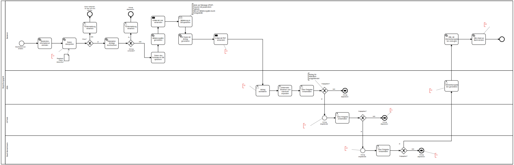

# Welcome Money - Camunda BPM Process Application
A Process Application for [Camunda BPM](http://docs.camunda.org). Prototype to model the process
of handling the welcome money process from our university. This includes the student requesting the money,
the AStA checking the data and two other institutions authorizing the request. In the end
a transfer (SEPA XML format) to the local bank is sent.

More information regarding the process are located in the [documentation](documentation) folder!
## Process
[BPMN Process](src/main/resources/GPM_Prozess_Begruessungsgeld.bpmn)



## Highlights
Uses a variety of more complex mechanisms regarding the camunda engine universe
including:

- User and group managements using Java API (@OnDeployment-hook)
- External web service starting process instances with certain starting process variables (studentID)
- Usage of soap-http-connector calling an external SOAP web service
- Generation of activation links
- Sending of emails
- Usage of so called "receiving tasks" and "messages" to stall process until external user clicks activation link
- PDF file generation
- PDF preview in embedded form in user task
- Generation of valid SEPA XML transaction
- fully dockerized experience (docker-compose including SOAP web-service and maven build container)

## How to use it?
#### Mailtrap.io
This projects uses [Mailtrap.io](https://mailtrap.io/) to mimic email sending and receiving. In order
to get the full experience of this prototype it is recommended to use Mailtrap.io, altough
it is possible to just use Postman or curl for the needed GET and POST requests.

**Credentials for [Mailtrap.io](https://mailtrap.io/)**:

**Username:** gpma.addmin@gmail.com <br>
**Password:** &9SQJpn785P5Fya
#### The (comfort) Docker way
Just execute the shell script:
```bash
./build-fully.sh
```

Camunda can then be found under:
```bash
http://localhost:8080/camunda/app
```

The start "web site" can be found under:
```bash
http://localhost:8089/geld.html
```
##### Major bug
The camunda official docker image comes with an undeterministic SPIN behaviour. That is
the serialization of java objects while fetching from the frontend can be either JSON or XML (it's completely random). 
The project, rather the frontend needs JSON
to be loaded first to use java objects in the front end. If you can't see any value in embedded forms in 
user tasks, rerun the camunda container (docker-compose down).

##### What it does:
First it runs the `docker-compose.yml` file which will pull and run the two containers. The first one
being the official camunda process engine docker image running on port ``8080``. The second one
is the custom SOAP web service which can be found here [Github Repo](https://github.com/kono94/student-web-service/).
This is essentially a spring boot SOAP service which additionally serves a static .html and handles the post requests needed
to trigger messages to the camunda engine. The web service is exposed on port ``8089``.

Afterwards a temporary maven container is being started. After successful startup the ``pom.xml``
and the ``src``-folder is being copied the container. The project is built inside the container. The resulting
.war is copied back to the local machine and is then copied (dockercp) into the camunda container.
All this is done because the .war file cannot be part of the camunda Dockerfile of this project
because the default "invoice" example from the official camunda docker is loaded into the
engine after this project's .war. The @AfterDeployment-Hook is unable to revert the default
user because they get readded when the "invoice" example is getting deployed.

In the end the maven container is stopped and completely removed.

#### Or manually...
1. Build the application using:
```bash
mvn clean package
```
2. Pull the camunda engine docker image, start it and just copy the ``.war`` into `/webapps`
```bash
docker pull camunda/camunda-bpm-platform:tomcat-7.14.0
docker run -d --name camunda -p 8080:8080 camunda/camunda-bpm-platform:tomcat-7.14.0
```
```bash
docker cp ./target/student-money.war camunda:/camunda/webapps/
```

Alternatively...
2. Copy the *.war file from the `target` directory to the deployment directory
of your application server e.g. `tomcat/webapps` or `wildfly/standalone/deployments`.
For a faster 1-click (re-)deployment see the alternatives below.

## Additional information
#### Useful REST-API calls:
Show all deployments:

````bash
localhost:8080/engine-rest/process-definition
````

Get a list of all running process instances:

````bash
localhost:8080/engine-rest/history/process-instance
````

Example on how to trigger a message to continue a process which is waiting
in a receiving task. You could use Postman to setup a request like this
(Finds the specific process instance with businessKey=34937 and a process variable
"activationLink"=="61f3dcc3-e5d3-4608-8f98-b9140f94539a")

````bash
Method: POST
HOST: localhost:8080/engine-rest/message
Body:
{
	"messageName" : "activationLinkClickedMessage",
	"businessKey" : "34937",
	"correlationKeys" : {
	    "activationLink" : {"value" : "61f3dcc3-e5d3-4608-8f98-b9140f94539a", "type": "String"}
	},
	"all": false
}
````

## License
[Apache License, Version 2.0](http://www.apache.org/licenses/LICENSE-2.0).

<!-- HTML snippet for index page
  <tr>
    <td></td>
    <td><a href="snippets/student-money">Camunda BPM Process Application</a></td>
    <td>A Process Application for [Camunda BPM](http://docs.camunda.org).</td>
  </tr>
-->
<!-- Tweet
New @Camunda example: Camunda BPM Process Application - A Process Application for [Camunda BPM](http://docs.camunda.org). https://github.com/camunda-consulting/code/tree/master/snippets/student-money
-->
